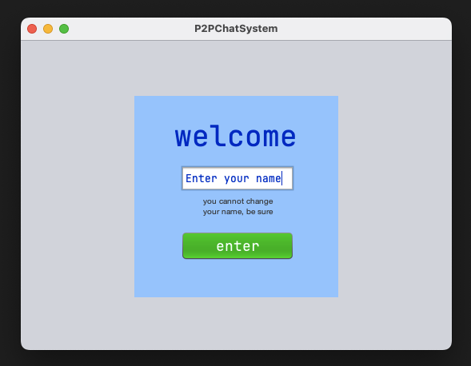

# P2PChatSystem2025
L3 integrated project

#### technology :

- java (awt, swing)

#### aim :

use discrete event system (event driven) into a project
to create an app to discuss between users **peer to peer
chat system** like in the title. No server, no DNS, only the app.
It's a reminder about POO and good practices and java components.
Those were seen last year.

#### requirements :

- java 23 (or later)
- the app (jar file made later)

#### how to install ?

this information is provided later
(WIP)

#### preview

<!-- end page -->
